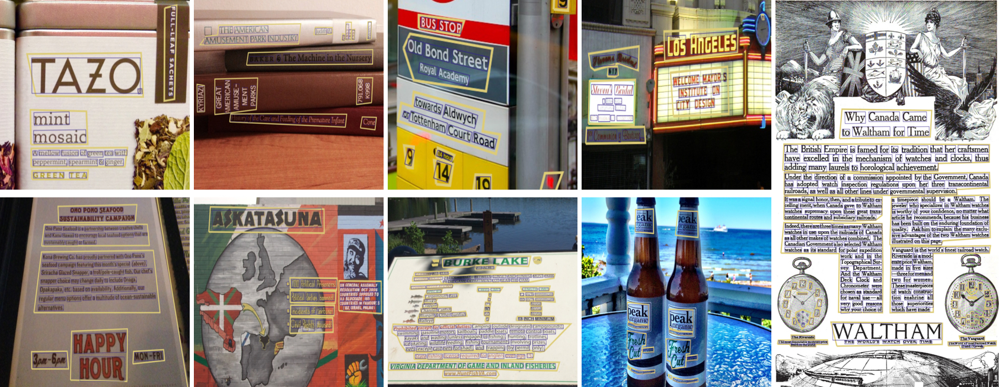

# The HierText Dataset

## Overview



HierText is the first dataset featuring hierarchical annotations of text in
natural scenes and documents. The dataset contains 11639 images selected from
the
[Open Images dataset](https://storage.googleapis.com/openimages/web/index.html),
providing high quality word (~1.2M), line, and paragraph level annotations. Text
lines are defined as connected sequences of words that are aligned in spatial
proximity and are logically connected. Text lines that belong to the same
semantic topic and are geometrically coherent form paragraphs. Images in
HierText are rich in text, with average of more than 100 words per image.

We hope this dataset can help researchers developing more robust OCR models and
enables research into unified OCR and layout analysis.

## Getting Started

First clone the project:

```
git clone https://github.com/google-research-datasets/hiertext.git
```

(Optional) Create and enter a virtual environment:

```
virtualenv -p python3 hiertext_env
source ./hiertext_env/bin/activate
```

Then install the required dependencies using:

```
cd hiertext
pip install -r requirements.txt
```

The ground-truth annotations of `train`, `validation` and `test` sets are
contained in three compressed .jsonl files: `train.jsonl.gz`, `val.jsonl.gz` and
`test.jsonl.gz` respectively, under `gt` subdirectory. Use the following command
to decompress the three files:

```
gzip -d gt/*.jsonl.gz
```

The images are hosted by [CVDF](http://www.cvdfoundation.org/). To download them
one needs to install
[AWS CLI](https://docs.aws.amazon.com/cli/latest/userguide/getting-started-install.html)
and run the following:

```
aws s3 --no-sign-request cp s3://open-images-dataset/ocr/train.tgz .
aws s3 --no-sign-request cp s3://open-images-dataset/ocr/validation.tgz .
aws s3 --no-sign-request cp s3://open-images-dataset/ocr/test.tgz .
tar -xzvf train.tgz
tar -xzvf validation.tgz
tar -xzvf test.tgz
```

## Dataset Description

## Evaluation

## License

The HierText dataset are released under
[**CC BY-SA 4.0**](https://creativecommons.org/licenses/by-sa/4.0/) license.
Please cite the following paper if you use the dataset in your work:

```
@inproceedings{long2022towards,
  title={Towards End-to-End Unified Scene Text Detection and Layout Analysis},
  booktitle={Proceedings of the IEEE/CVF Conference on Computer Vision and Pattern Recognition},
  year={2022}
}
```

